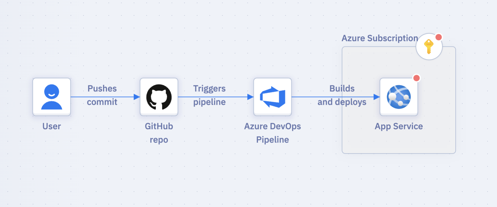
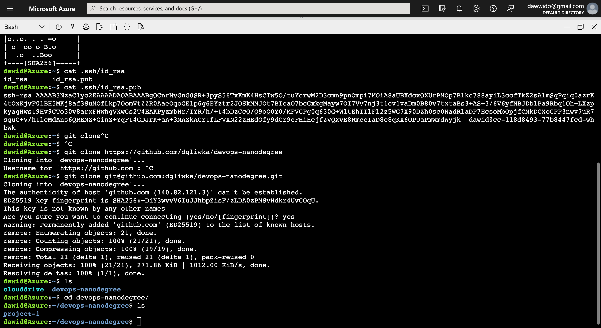
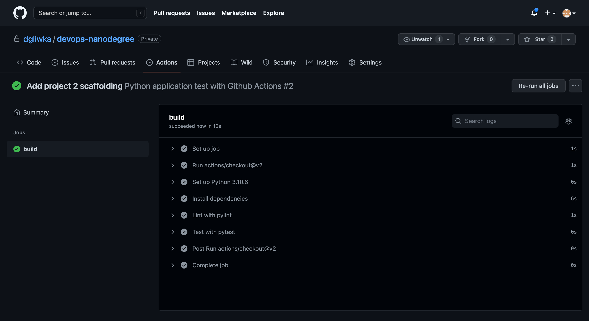
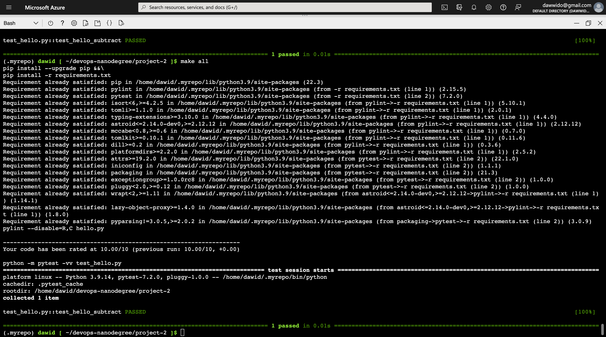
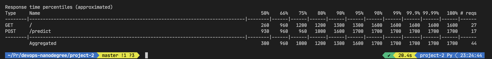
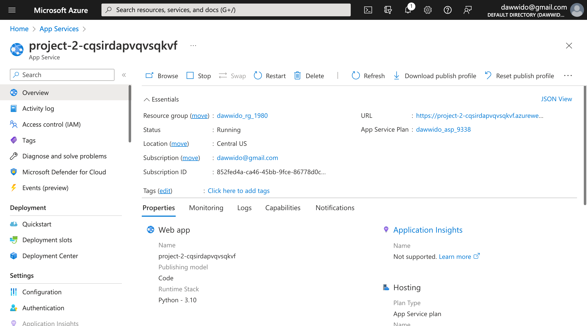
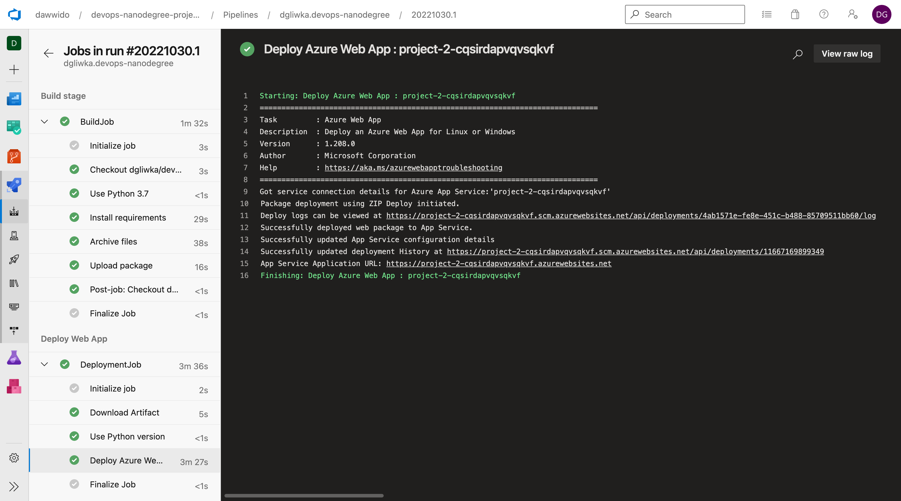
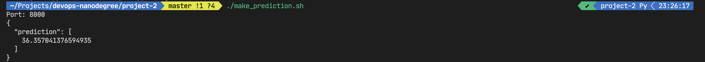
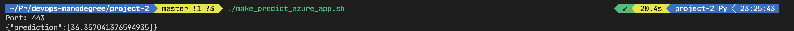
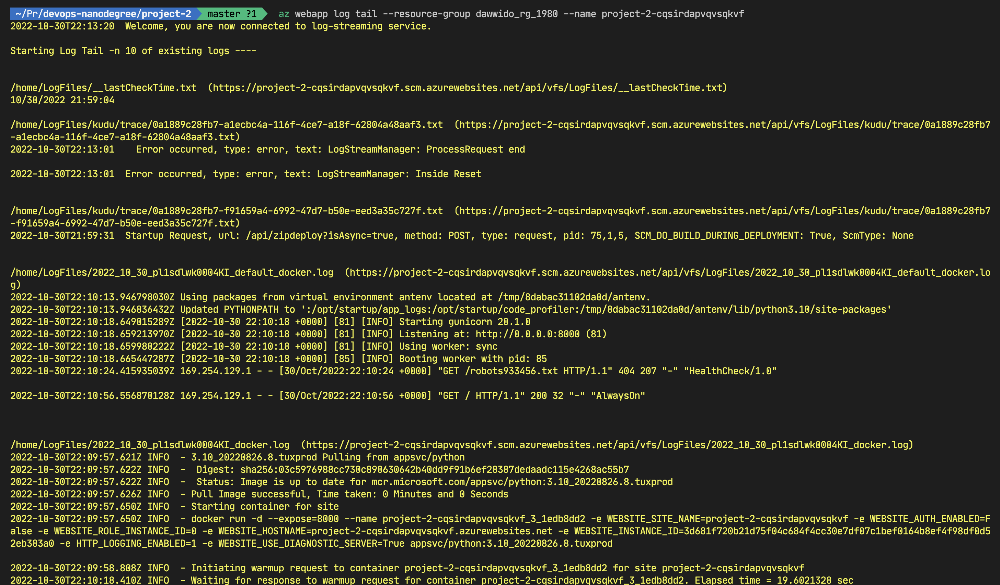

# Overview

In this project we explore simple automation mechanisms for developing and deploying a web API which is using sklearn to predict housing prices in Boston.

Project is using Azure DevOps for CI/CD and deploys to Azure App Service.
In initial scaffolding phase GitHub Actions were used for CI/CD.
App is written in Python with Flask framework and SciKit Learn.

## Project Plan

* [Trello board](https://trello.com/b/pcRJtoen/project-2) for the project.

* [Spreadsheet](https://docs.google.com/spreadsheets/d/1VeBu-8GGrVajBjKSx1e3vz1Y8MdXrcLleoHUBnBnEh8/edit?usp=sharing) that includes the original and final project plan

## Instructions for running project youself!

* Architectural Diagram (Shows how key parts of the system work)

### Running project locally

1. Clone the repo with `git clone git@github.com:dgliwka/devops-nanodegree.git`.
2. Change to `project-2` directory with `cd project-2`.
3. Run `make setup` to create *venv* - virtual environment for project's python dependencies.
4. Run `make all` to install all required dependencies, lint and test the project.
5. Run `python3 app.py` to start the web server.
6. Run `make_prediction.sh` to test the local API.

### Running project on Azure App Service

1. Clone the repo with `git clone git@github.com:dgliwka/devops-nanodegree.git`.
2. Change to `project-2` directory with `cd project-2`.
3. Login to Azure with `az login` or proceed to step 4 if you are using Azure Cloud Shell, and you are already logged.
4. Run `az webapp up -n project-2-cqsirdapvqvsqkvf` to deploy the app to Azure App Service.

## Screenshots of the different stages of the project

* Creating *ssh* key pair and adding it to the GitHub account. Project cloned into Azure Cloud Shell

* GitHub actions workflow run for project initial scaffolding.

* Passing tests that are displayed after running the `make all` command from the `Makefile`

* Output of a locust load test

* Successful deploy of the project in Azure App Service.

* Running Azure App Service from Azure Pipelines automatic deployment

* Successful prediction from deployed flask app in Azure Cloud Shell.

* Successful prediction from deployed flask app in App Service.

* Output of streamed log files from deployed application

## Enhancements

Project can be enhanced in the following ways:

* Add locust load test to the Azure Pipeline workflow.
* Add deployment to different App Service slots (dev, qa, uat environments, blue/green deployments).
* Add packing and deployment of the app as a Docker container.
* Add deployment to Azure Kubernetes Service.

## Demo time

[Screencast on YouTube](https://youtu.be/TgOeyB6Glcc)
